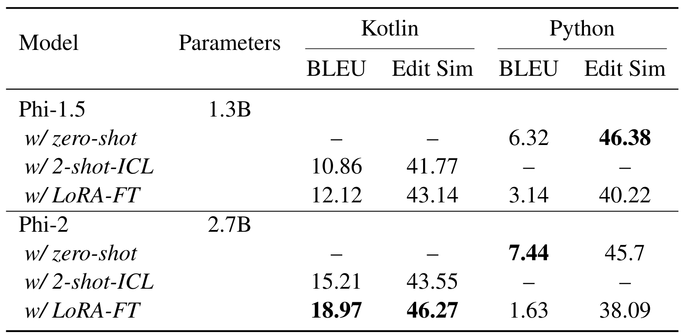

# Jetbrains Code Generation Assignment

## Table of Contents

   * [Usage](#usage)
   * [Results](#results)


## Usage

Clone the project.
```bash
git clone https://github.com/Nickil21/code-completion-jetbrains.git
cd code-completion-jetbrains/
```

Activate conda environment and install the necessary libraries.
```bash
conda create -n jetbrains_code_completion python=3.10
pip install -r requirements.txt
conda activate jetbrains_code_completion
```

Cache models and datasets path.
```bash
export TORCH_HOME=<TORCH_HOME_PATH>
export HF_HOME=<HF_HOME_PATH>
export HF_DATASETS_CACHE=<HF_DATASETS_CACHE>
```

Set python path to current working directory.
```bash
export PYTHONPATH=${PWD}
```

Set library path to avoid `cublasLtHSHMatmulAlgoInit` error.
```bash
export LD_LIBRARY_PATH=<CONDA_ENV_PATH>/jetbrains_code_completion/lib/python3.10/site-packages/nvidia/cublas/lib/:$LD_LIBRARY_PATH
```

Disable TOKENIZERS_PARALLELISM=(true | false) warning.
```bash
export TOKENIZERS_PARALLELISM=false
```

Set project and dataset path.
```bash
export PROJECT_DIR=${PWD}
export DATASET_DIR=$PROJECT_DIR/dataset
export KOTLIN_DATASET_DIR=$PROJECT_DIR/dataset/LeetCode-Kotlin
```

We choose [LeetCode-Kotlin](https://github.com/sshpark/LeetCode-Kotlin) codebase as the open-source project to curate the code completion dataset. It contains solutions to 109 [LeetCode](https://leetcode.com/) problems written in Kotlin. Clone the repository and store files.
```bash
git -C "$KOTLIN_DATASET_DIR" pull || git clone https://github.com/sshpark/LeetCode-Kotlin.git "$KOTLIN_DATASET_DIR"
cd $KOTLIN_DATASET_DIR
kaggle datasets download -d gzipchrist/leetcode-problem-dataset
unzip -n leetcode-problem-dataset.zip && rm leetcode-problem-dataset.zip
```

Download the test part of CodexGlue which performs method generation.
```bash
cd $DATASET_DIR
mkdir -p CodeXGLUE-Python
cd CodeXGLUE-Python/
curl -X GET "https://datasets-server.huggingface.co/first-rows?dataset=microsoft%2Fcodexglue_method_generation&config=default&split=test" |  python -m json.tool > test.json
wget -nc https://raw.githubusercontent.com/microsoft/CodeXGLUE/main/Code-Code/Method-Generation/evaluator/answers.txt
```

We format the input code conditioned on the function signature and description. We limit the descriptions to 200 characters to capture the main intent of the code and not consider the test cases, for instance. We preprocess the Kotlin dataset and create train/valid/test random splits in the ratio of 60/20/20.
```bash
cd $PROJECT_DIR
python source/prepare_dataset.py
```

The data format of each line roughly looks like:
```json
{
    "id":26,
    "signature":"class Solution { fun removeDuplicates(nums: IntArray): Int {",
    "docstring":"Given a sorted array nums, remove the duplicates in-place such that each element appears only once and returns the new length.\n\nDo not allocate extra space for another array, you must do this by modifying the input array in-place with O(1) extra memory.\n\nClarification:\nConfused why the returned value is an integer but your answer is an array?\nNote that the input array is passed in by reference, which means a modification to the input array will be known to the caller as well.\n\nInternally you can think of this:\n\/\/ nums is passed in by reference. (i.e., without making a copy)\nint len = removeDuplicates(nums);\n\/\/ any modification to nums in your function would be known by the caller.\n\n\/\/ using the length returned by your function, it prints the first len elements.\n\nfor (int i = 0; i < len; i++) {\n    print(nums[i]);\n}\n\nExample 1:\nInput: nums = [1,1,2]\nOutput: 2, nums = [1,2]\nExplanation: Your function should return length = `2`, with the first two elements of `nums` being `1` and `2` respectively. It doesn't matter what you leave beyond the returned length.\n\n\nExample 2:\nInput: nums = [0,0,1,1,1,2,2,3,3,4]\nOutput: 5, nums = [0,1,2,3,4]\nExplanation: Your function should return length = `5`, with the first five elements of `nums` being modified to `0`, `1`, `2`, `3`, and `4` respectively. It doesn't matter what values are set beyond the returned length.\n\n\nConstraints:\n`0 <= nums.length <= 3 * 104`\n`-104 <= nums[i] <= 104`\n`nums` is sorted in ascending order.",
    "body":"var cnt = if (nums.size > 0) 1 else 0 for (i in 1 until nums.size) { if (nums[i] == nums[i-1]) continue nums[cnt] = nums[i] cnt++ } return cnt } }",
    "difficulty":"easy"
}
```

The average token length for the Kotlin test set is 73.09 while for the Python test set it is 22.23 which makes code completion more challening.

We choose two variants of a transformer model specialized for basic Python coding, the [phi-1.5](https://huggingface.co/microsoft/phi-1_5) and [phi-2](https://huggingface.co/microsoft/phi-2) and assess its ability to perform code completion on an unseen programming language, Kotlin.

We perform zero-shot inference and in-context learning (ICL) using two-shot prompting to adapt the LLMs to learn a new programming language from scratch which it has not been trained on before. We select *two* samples (2-shot ICL) from the validation set and convert them to corresponding code-style pairs. We concatenate them as a string to form in-context demonstrations. Given a test sample, we first convert it to a code prompt and prepend the demonstration context. We generate function completions using nucleus sampling with `top_p` 0.95 and `top_k` 5. The sampling temperature is set at 0.2 and the maximum generation length is 1024 tokens.

```bash
python source/evaluate.py --checkpoint="microsoft/phi-1_5" --zero_shot_evaluate
python source/evaluate.py --checkpoint="microsoft/phi-2" --zero_shot_evaluate
```

We perform parameter-efficient finetuning (PEFT) using LoRA. We use PEFT to mitigate catastrophic forgetting so as to not forget previously learned knowledge.
```bash
python source/evaluate.py --checkpoint="microsoft/phi-1_5" --batch_size=32 --epochs=2 --finetune_evaluate
python source/evaluate.py --checkpoint="microsoft/phi-2" --batch_size=32 --epochs=2 --finetune_evaluate
```

We then perform inference on the fine-tuned models which are saved in the Huggingface Hub as [phi-1_5-LoRA-finetuned](https://huggingface.co/nickil/phi-1_5-LoRA-finetuned) and [phi-2-LoRA-finetuned](https://huggingface.co/nickil/phi-2-LoRA-finetuned). The trainer artifacts are logged in [wandb](https://wandb.ai/nickil21/jetbrains-code-completion).

The prediction files are stored in `temp/kotlin` and `temp/python` directories.

The whole pipeline takes about 4 hours to run on a single A100 80GB GPU.

## Results

We use Edit-Similarity and BLEU as the evaluation metrics. A higher score (applicable to both metrics) between the ground truth and the completion output indicates better performance. 



We can see that:

* ICL can help teach provide knowledge on the Kotlin language which the model has not seen, significantly improving out-of-domain code generation abilities.
* For Kotlin, larger model sizes tend to produce accurate code generations compared to their smaller variants.
* After PEFT, we notice an improvement in the overall metric performance for Kotlin. For instance, in the ICL-setting, the model sometimes get confused and uses python function declaration and control-flow statements. This confusion gets eliminated after finetuning. 
* After PEFT, we see a performance degradation on Python which indicates that PEFT might not be be the right strategy to preserve previous knowledge. Alternatively, we can rely on continual leaning (CL) apporaches, for e.g., prompting- and experience replay-based methods, to address this. We can observe that finetuning affects highly specialized models (phi-2) more adversely compared to its lesser enhanced ones (phi-1.5).


In future, we can perform static analysis on the abstract syntax trees (e.g., [detekt](https://github.com/detekt/detekt)) on the context (function signature + docstring) and the function body which can help us understand different error types and its impact on the generated code. We can also leverage popular datasets (like MBPP) translated to Kotlin ([MBKP](https://arxiv.org/pdf/2210.14868)) and use the provided test cases to compute the pass@k scores to understand functional correctness.
